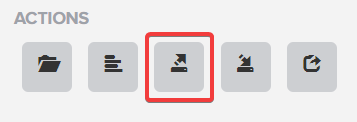
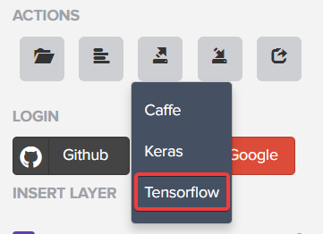

# How to use pbtxt to import tensorflow model

1. Select the 3rd button in the Actions section:

    
2. In appeared dropdown list select Tensorflow. This should download a `.pbtxt` file

    
3. Rename the file to `model.pbtxt`
4. In the folder with model file execute this code:
    ```python
    import tensorflow as tf
    from google.protobuf import text_format

    with open('BostonFC.pbtxt', 'r') as model_file:
        model_protobuf = text_format.Parse(model_file.read(),
                                        tf.GraphDef())

    tf.import_graph_def(model_protobuf)

    print([n.name
           for n in tf.get_default_graph().as_graph_def().node
           if "Variable" in n.op])
    ```
    It should output list of variables that are in the graph.

## Code template
[explore_tensorflow_model.py](../example/tensorflow/code_template/explore_tensorflow_model.py) - finds variables and placeholders in model.

[tensorflow_fashion_mnist.py](../example/tensorflow/code_template/tensorflow_fashion_mnist.py) - training CNN on Fashion MNIST dataset. Before you run this file don't forget to install `tqdm` package. It enhances the output with progress bars to watch the training and evaluation process.

## Reference
[Towards Data Science blog](https://towardsdatascience.com/cifar-10-image-classification-in-tensorflow-5b501f7dc77c) - how to build neural network with low-level API.